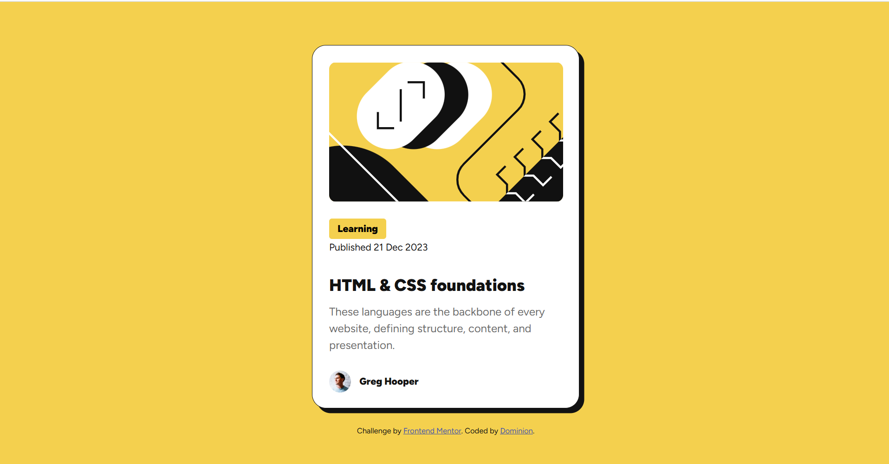

# Frontend Mentor - Blog preview card solution

This is a solution to the [Blog preview card challenge on Frontend Mentor](https://www.frontendmentor.io/challenges/blog-preview-card-ckPaj01IcS). Frontend Mentor challenges help you improve your coding skills by building realistic projects. 

## Table of contents

- [Overview](#overview)
  - [The challenge](#the-challenge)
  - [Screenshot](#screenshot)
  - [Links](#links)
- [My process](#my-process)
  - [Built with](#built-with)
  - [What I learned](#what-i-learned)
  - [Continued development](#continued-development)
- [Author](#author)
- [Acknowledgments](#acknowledgments)

## Overview

### The challenge

Users should be able to:

- See hover and focus states for all interactive elements on the page

### Screenshot

### Links

- Solution URL: [https://github.com/why-not-phoenix/frontend-mentor-blog-preview-card](https://github.com/why-not-phoenix/frontend-mentor-blog-preview-card)
- Live Site URL: [https://why-not-phoenix.github.io/frontend-mentor-blog-preview-card/](https://why-not-phoenix.github.io/frontend-mentor-blog-preview-card/)

## My process

### Built with

- Semantic HTML5 markup
- CSS custom properties
- Flexbox
- I wouldn't say Mobile-first workflow, but definitely mobile supported
- Bootstrap (minimal)

### What I learned

This might be a bit messy, especially my HTML. Did my best to provide good accessibility. Had fun using Figma for the first time, made things a lot easier, can't wait to see how it comes out. This should be more difficult than my last submission but I found it a lot easier. I guess it's all coming back. Tried adding JS or Bootstrap but the project is too small, and I didn't want to over complicate things.

### Continued development

Figma usage is one I'd like to master. Building responsive websites and improved knowledge of library usage to make things easier.

## Author

- Frontend Mentor - [@why-not-phoenix](https://www.frontendmentor.io/profile/why-not-phoenix)
- Twitter - [@dominion_onoja](https://x.com/dominion_onoja?t=RAWgmHy3YlUySDiPDnZS2g&s=09)

## Acknowledgments

All me and Frontend Mentor!!!